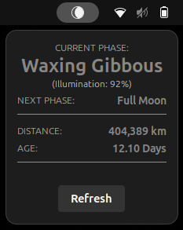

# 🌙 Luna - Moon Phase Indicator

Luna is a GNOME Shell extension that displays the current moon phase directly in your top bar. Using astronomical calculations based on the Julian Date algorithm, Luna provides accurate lunar information without requiring an internet connection.

---

## ✨ Features

- **Panel Icon** - Shows current moon phase with beautiful custom icons
- **Detailed Popup** with:
  - Current phase name
  - Next phase
  - Illumination percentage
  - Distance from Earth (km)
  - Lunar age (days)
- **Works Offline** - Uses astronomical formulas, no internet required
- **Configurable** - Adjustable update interval (15 min - 24 hours)
- **Lightweight** - Minimal resource usage

---

## 📷 Screenshots

> Panel icon in top bar


> Popup menu with lunar details



---

## 🛠 Installation

### From GNOME Extensions Website

Install Luna from [extensions.gnome.org](https://extensions.gnome.org/extension/luna/).

Make sure you have [GNOME Shell integration](https://wiki.gnome.org/Projects/GnomeShellIntegration) enabled for your browser.

### Manual Installation

```bash
# Clone the repository
git clone https://github.com/thanderoy/luna.git
cd luna

# Compile the settings schema
glib-compile-schemas luna@thanderoy.github.io/schemas/

# Copy to GNOME extensions directory
cp -r luna@thanderoy.github.io ~/.local/share/gnome-shell/extensions/

# Enable the extension
gnome-extensions enable luna@thanderoy.github.io
```

**Restart GNOME Shell:**
- **Xorg**: Press `Alt+F2`, type `r`, press Enter
- **Wayland**: Log out and log back in

---

## ⚙️ Configuration

Open extension preferences:

```bash
gnome-extensions prefs luna@thanderoy.github.io
```

**Available Settings:**
- **Update Interval** - How often to recalculate moon phase (15 min - 24 hours)

---

## 🔧 Troubleshooting

### Extension not appearing
1. Verify it's enabled: `gnome-extensions info luna@thanderoy.github.io`
2. Check for errors: `journalctl -f -o cat /usr/bin/gnome-shell | grep Luna`
3. Restart GNOME Shell

### Schema compilation errors
Install glib2 development tools:

```bash
# Fedora/RHEL
sudo dnf install glib2-devel

# Ubuntu/Debian
sudo apt install libglib2.0-dev-bin

# Arch
sudo pacman -S glib2
```

---

## 🧮 How It Works

Luna calculates moon phases using the **Julian Date algorithm**:

1. Converts current date to Julian Date
2. Calculates days since a known new moon (Jan 6, 2000)
3. Uses the synodic month length (~29.53 days) to determine lunar age
4. Maps lunar age to one of 8 phases
5. Calculates illumination using cosine approximation

This approach is:
- **Accurate** - Based on established astronomical formulas
- **Offline** - No internet connection required
- **Fast** - Instant calculations, no network latency

---

## 🤝 Contributing

Contributions are welcome!

1. Fork the repository
2. Create a feature branch: `git checkout -b feature/amazing-feature`
3. Test in a GNOME Shell environment
4. Commit: `git commit -m 'Add amazing feature'`
5. Push: `git push origin feature/amazing-feature`
6. Open a Pull Request

### Development

```bash
# Clone and make changes
git clone https://github.com/YOUR_USERNAME/luna.git
cd luna

# Test changes
glib-compile-schemas luna@thanderoy.github.io/schemas/
cp -r luna@thanderoy.github.io ~/.local/share/gnome-shell/extensions/

# Monitor logs
journalctl -f -o cat /usr/bin/gnome-shell | grep Luna
```

---

## 📄 License

GNU General Public License v2.0 - see [LICENSE](LICENSE)

---

## 💖 Support

If you find Luna useful, consider supporting development:

[](https://buymeacoffee.com/thanderoy)

---

Made with 🌙 by [thanderoy](https://github.com/thanderoy)
