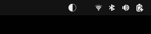

# 🌙 Luna - Moon Phase Indicator

Luna is a simple GNOME Shell extension that displays the current moon phase directly in your top bar. With beautiful custom icons and real-time updates, Luna helps you stay attuned to lunar cycles throughout your day.

---

## ✨ Features

- Shows the current moon phase as a panel icon
- Hoverable popup with:
  - Current phase name
  - Next phase
  - Illumination percentage
  - Distance (Meridian)
  - Age of the moon phase
- Refresh button for manual updates
- Updates automatically every hour
- Lightweight and unobtrusive

---

## 📷 Screenshots

> On top bar



> Next phase, illumination %


---

## 🛠 Installation

### 🔌 From GNOME Extensions Website

Once published, you’ll be able to install Luna from [extensions.gnome.org](https://extensions.gnome.org).
Make sure you have [GNOME Shell integration](https://wiki.gnome.org/Projects/GnomeShellIntegration) enabled for your browser.

### 💻 Manual Installation (Development or Sideloading)

```bash
git clone https://github.com/thanderoy/luna.git
cp -r luna/ ~/.local/share/gnome-shell/extensions/luna@thanderoy.github.io
gnome-extensions enable luna@thanderoy.github.io
